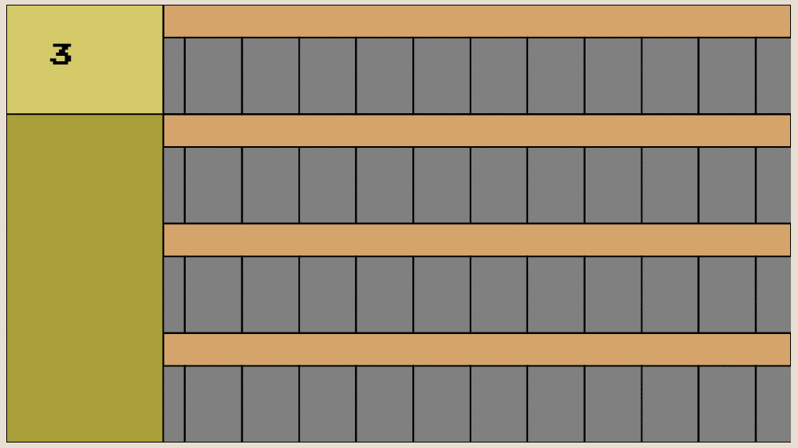
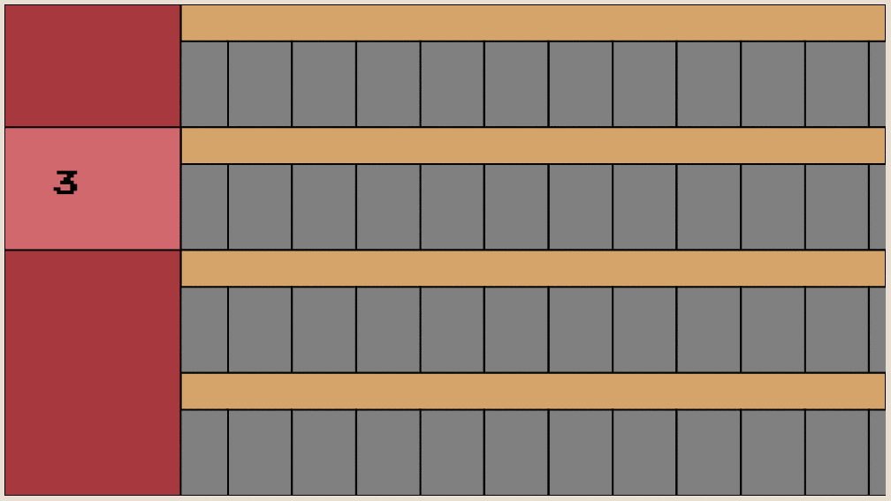

## Robo-loader

A common thing seen in video games is that their parts of their mechanics can be seen as modular and a game all by itself.
A real life parallel might be that you are walking down the street while trying to go somewhere (the game as a whole), and
you have to watch your feet and avoid stepping in slosh puddles(the mini-game).

#### So I really like World of Warcraft.
And WoW has such a mini-game.
Game balancing also really interest me too
so I tried to distill the basic mechanics of this mini-game into a javascript canvas game. so I could turn some knobs and see how they affect the way it plays.

##### The things I was interested in were:
* pacing
* difficulty
* depth

Before we get too far into the things I've learned I would help to explain the game itself. The game can be played [here](/robo-loader). Please note the game might look different now than at the time of this post but the basic mechanics will still be in place.

### Basics:
You work in a factory that has a number of horizontal Lanes(4 in this picture). Inside of each is a "conveyor belt" with a number of cells. The cells move to the right and from the left and carry whatever is on them.

On the left side of the screen is a "Loading Area" where we can put a certain amount of "material" down on a given Conveyor Belt.

The Above picture shows that the loading area will put down 3 cells worth of yellow "material"

 Here we just put down 3 red blobs worth of material. The numbers on the left mean that the next time we put down a red material on that lane we will only put down 2 blobs worth of red material.

 The white boxes represent the workers in this factory. The workers will move up the lanes to the left if they have nothing to work on. If a single worker reaches the loading area the game is over.

 

 By putting down material in a lane for a worker to work on, you impede its progress towards the loading area.

### Things I learned

* ##### This game is like 10x more complicated once I started explaining it to myself
  * The narrative in my head before sitting down to write the code out was like "yeah you got"

* ##### This game is like 10x more complicated once I started explaining it to myself
  * The narrative in my head before sitting down to write the code out was like "yeah you got"

You
