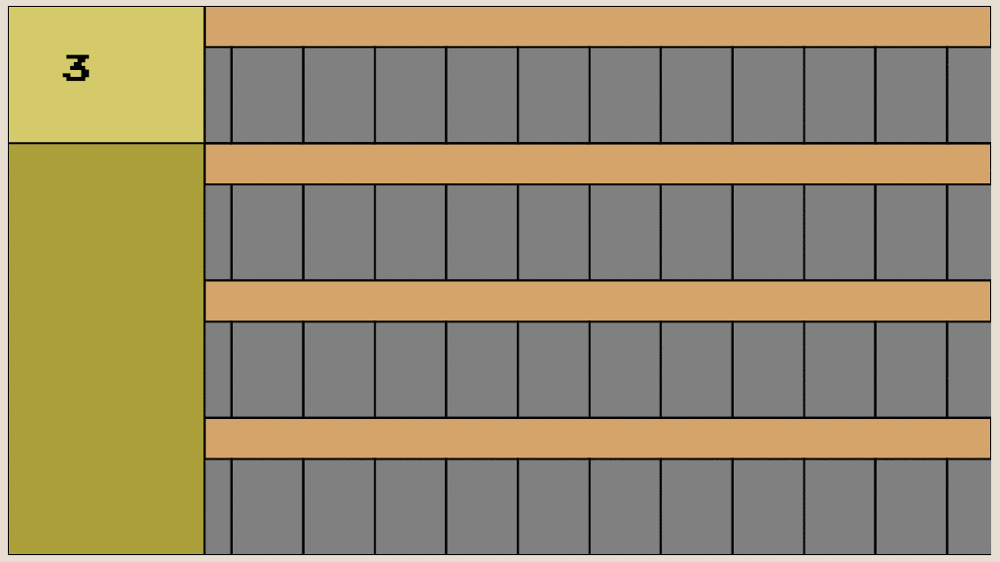
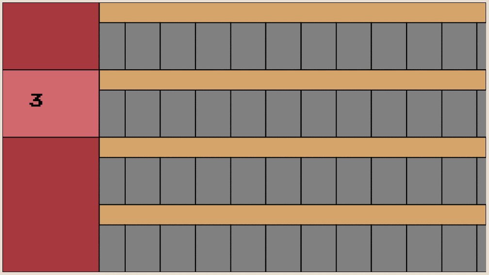
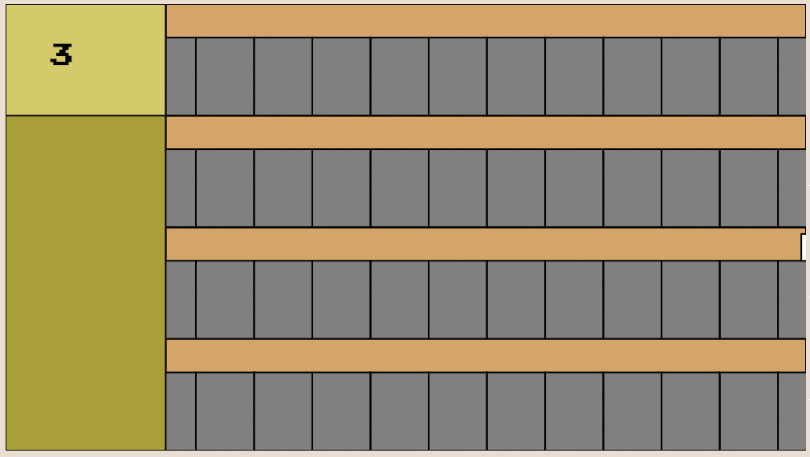
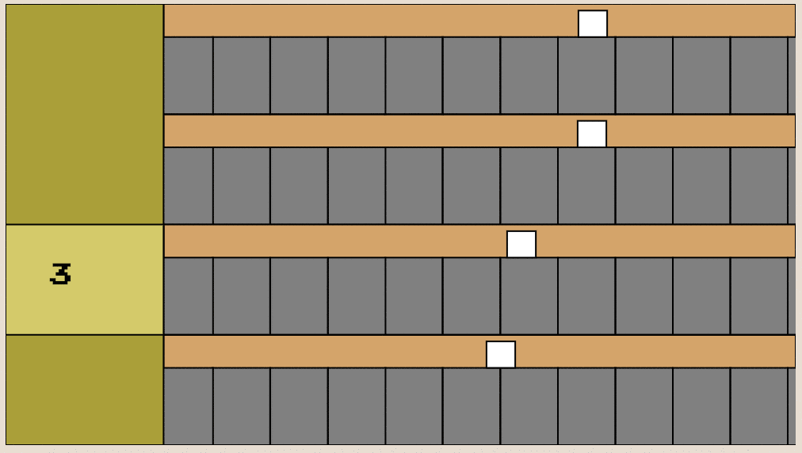

## Robo-loader
[github](https://github.com/HoffsMH/robo-loader)

A common thing seen in video games is that parts of their mechanics can be seen as modular and a game all in and of themselves.
A real life example of this might be that you are walking down the street while trying to go somewhere (the game as a whole), and
you have to watch your feet and avoid stepping on cracks(mini-game).

#### So I really like World of Warcraft.
And WoW has such a mini-game.
Game balancing also really interest me too
so I tried to distill the basic mechanics of this of this mini-game into a javascript canvas game. so I could turn some knobs and see how they affect the way it plays.

##### The things I was interested in were:
* pacing
* difficulty
* depth

The game can be played [here](/robo-loader). Please note the game might look different now than at the time of this post but the basic mechanics will still be in place.

### Basics:
You are a robot that works in a factory that has a number of horizontal Lanes( 4 in this picture). Inside of each is a "conveyor belt" with a number of cells. The cells move to the right and carry whatever is placed on them.



On the left side of the screen is a "Loading Area" where we can put a certain amount of "material" down on a given Conveyor Belt.



 Here we just put down 3 red blobs worth of material. The numbers on the left mean that the next time we put down a red material on that lane we will only put down 2 blobs worth of red material.

 Lets look at the next game mechanic...

 

 The white boxes represent the workers in this factory. The workers will move to the left while they have nothing to work on. If a single worker reaches the loading area the game is over.

By putting down material on a conveyor belt for a lane worker to work on you impede its progress towards the loading area.

 

You might have noticed that there are 2 sets of numbers on the left. The big number, as I mentioned before, represents how many blobs of material you would place on the given conveyor belt if you were to press enter. The second smaller set of numbers is a counter that counts down till you can place the maximum amount of blobs again.

For instance I see the number 3, and the color green, and I have the fourth lane selected, I press enter and... 3 green blobs are placed on the first lane and then I see 2 and a counters starts counting down from 35 seconds. That means that after 35 seconds have passed the counter reset and I will be able to place 3 green blobs at a time on that lane.

We are now approaching the center of what this game is really about, managing diminishing returns. Something that has a diminishing return means I get a decreased effect from doing the same thing repeatedly. In order to keep the workers from getting to the left side of the screen I need to think about what lanes and color combinations are available to me at a given time.

For instance I might be out of yellow blobs on lane 1 but I have plenty red blobs left on that lane, and I might be out of red blobs on lane 2 but I have plenty of yellow blobs left on that lane. A few seconds later that situation may reverse and I have to keep track of that.

#### One more thing:

Lets say that all conveyor belts have 12 cells on which we can place blobs. If I put a Yellow blob on cell 1 of lane 2 that means that all other lanes's cell 1 are cleared of yellow blobs. If I put a yellow blob on lane 1 and immediately afterwards put a yellow blob on lane 2 the yellow blob on lane 1 will disappear.

When taken together the game is about juggling different colors on different lanes in order to keep the workers from reaching the end.

pic of average gameplay here

#### Tweaking it:
I tried to write this in such a way that changing certain aspects of the game would be easy. I did this by creating engines that would update and render the game  generically, regardless of their structure or settings. I then created a default settings file called ```lib/game-settings/board-settings``` that contained everything about the game that could be changed. All of the game component's properties were set by the contents of this file so that if I wanted to change something like
* amount of lanes
* amount of cells to a lane
* how long before diminsing returns reset
* how fast workers moved up the lane
* how long it took for a worker to clear a single blob


#### Lessons learned:

It was surprisingly easy to balance! the hard part was to end
