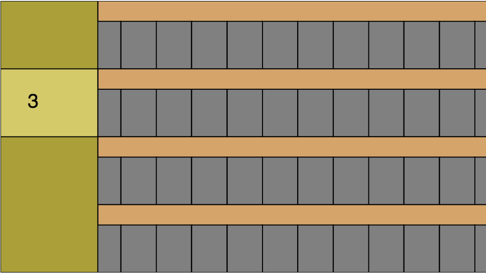

## Game within a game

A common thing seen in video games is that their parts of their mechanics can be considered modular.
Think (a Game within a Game, ... Gameception).
A real life parallel might be that you are walking down the street while trying to go somewhere (the game as a whole),
you have to watch your feet and avoid stepping in slosh puddles(the mini-game).

#### So I really like World of Warcraft.
And WoW has such a mini-game.
Game balancing also really interest me too
so I tried to distill the basic mechanics of this minigame into a javascript canvas game. so I could turn some knobs and see how they affect the way it plays.

##### Things like
* pacing
* difficulty
* depth

### Basics:
You work in a factory that has a number of horizontal Lanes(4 in this picture). Inside of each is a "conveyor belt" with a number of cells. The cells move to the right and carry whatever is on them to the right end of the screen.

On the left side of the screen is a "Loading Area" where we can put a certain amount of "stuff" down on a given Conveyor Belt.

Current picture shows that the loading area will put down 3 cells worth of yellow "stuff"

 

 Here we just put down 3 red blobs worth of stuff. The numbers on the left mean that the next time we put down a red stuff on that lane we will only put down 2 blobs worth of red stuff.

 

### Things I learned

* ##### This game is like 10x more complicated once I started explaining it to myself
  * The narrative in my head before sitting down to write the code out was like "yeah you got"

* ##### This game is like 10x more complicated once I started explaining it to myself
  * The narrative in my head before sitting down to write the code out was like "yeah you got"

You
